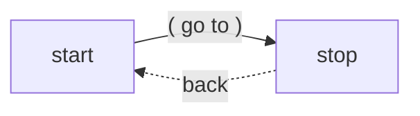
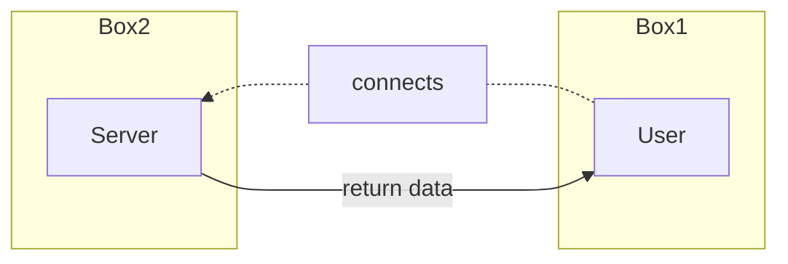
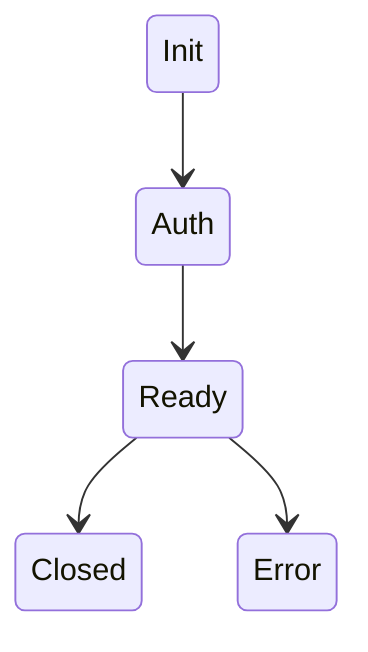
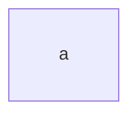

# Mermaid diagrams

Flowchart

```mermaid

flowchart LR
  a[start] --( go to )--> b[stop]
  b -.->|back| a
```

---

```mermaid

flowchart RL
  subgraph Box1
    User
  end
  subgraph Box2
    Server
  end

  User -.- connects -.-> Server

  Server -->|return data| User
```

---

```mermaid
%% comment
stateDiagram
  Init --> Auth
  Auth --> Ready
  Ready --> Closed
  Ready --> Error

```

```mermaid
erDiagram
  a

```

---

```mermaid
graph TD
  A --> B

```
